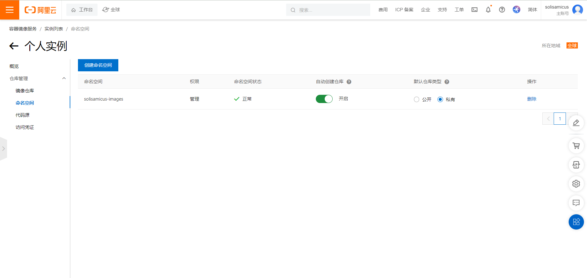
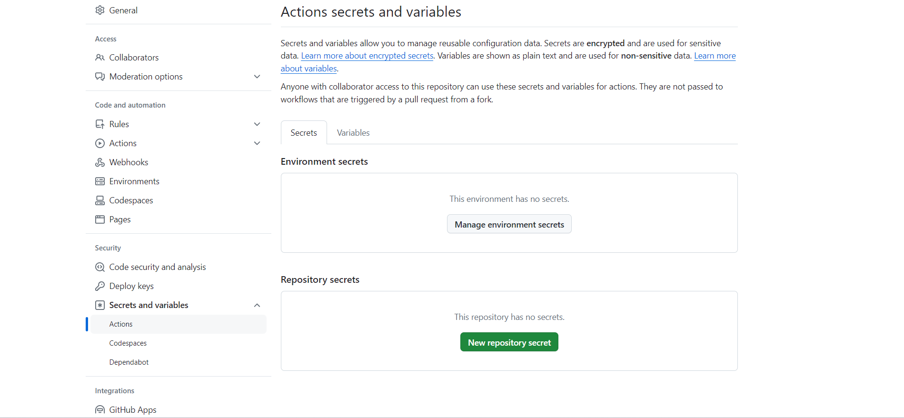
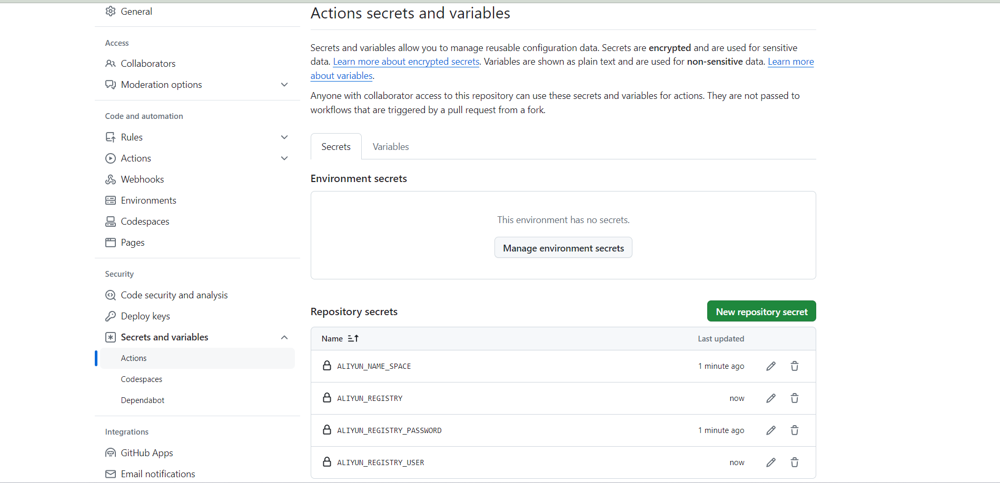
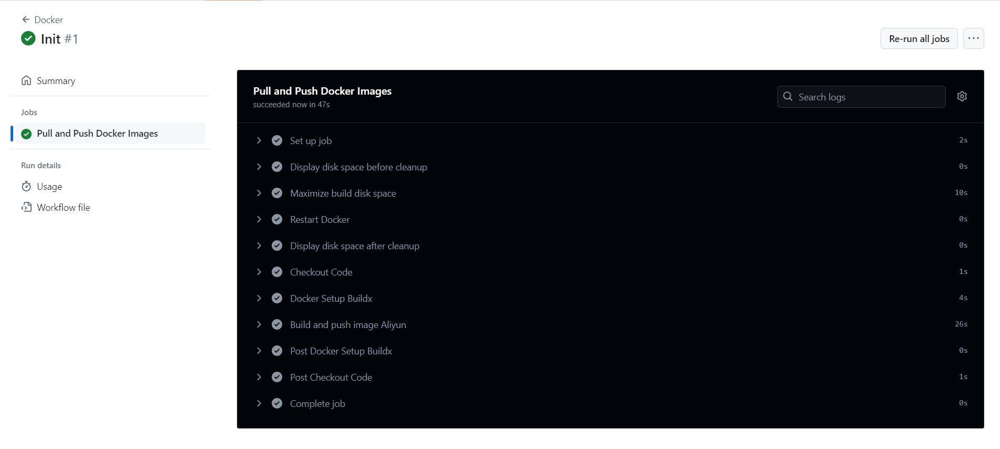
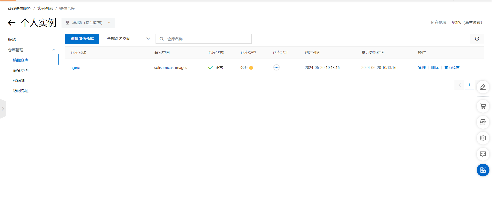

# Docker Image Sync

## Configure Alibaba Cloud Container Registry

Log in to Alibaba Cloud Container Registry：https://cr.console.aliyun.com/

Enable a personal instance，get the following environment parameters for configuration：

<div align='center'>
  
</div>

<div align='center'>
  
</div>

- $\text {ALIYUN_REGISTRY_PASSWORD}$：Password，Set when creating a personal instance.
- $\text {ALIYUN_NAME_SPACE}$：namespace, `solisamicus-images`.
- $\text {ALIYUN_REGISTRY_USER}$：Username, `solisamicus`.
- $\text {ALIYUN_REGISTRY}$：Repository Address, `registry.cn-wulanchabu.aliyuncs.com`.

## Fork Project

Fork this repository.

## Enable GitHub Actions

Enable GitHub Actions.

`Settings` -> `Secrets and variables` -> `Actions` -> `New Repository Secret`.

<div align='center'>
  
</div>

Add the four values obtained in the previous step as environment variables.

> ALIYUN_NAME_SPACE
>
> ALIYUN_REGISTRY
>
> ALIYUN_REGISTRY_PASSWORD
>
> ALIYUN_REGISTRY_USER

<div align='center'>
  
</div>

### Add Docker Images

Open the `images.txt` file and add the images you want.（Use `#` at the beginning of a line to add comments.）

:star:Example：

```
nginx
```

After committing the file, GitHub Actions will automatically start the build process.

<div align='center'>
  
</div>

Check Alibaba Cloud Container Registry and you will see that the corresponding image has been generated.

<div align='center'>
  
</div>

## Use Docker Images

Return to Alibaba Cloud Container Registry and check the status of your images.

> You can set images to public to allow pulling without login.

Pull the image on your server in China

```shell
docker pull ${ALIYUN_REGISTRY}/${ALIYUN_NAME_SPACE}/nginx
```

:star:Example：

```
docker pull registry.cn-wulanchabu.aliyuncs.com/solisamicus-images/nginx
```

```shell
$ docker pull registry.cn-wulanchabu.aliyuncs.com/solisamicus-images/nginx
Using default tag: latest
latest: Pulling from solisamicus-images/nginx
2cc3ae149d28: Pull complete 
a97f9034bc9b: Pull complete 
9571e65a55a3: Pull complete 
0b432cb2d95e: Pull complete 
24436676f2de: Pull complete 
928cc9acedf0: Pull complete 
ca6fb48c6db4: Pull complete 
Digest: sha256:80550935209dd7f6b2d7e8401b9365837e3edd4b047f5a1a7d393e9f04d34498
Status: Downloaded newer image for registry.cn-wulanchabu.aliyuncs.com/solisamicus-images/nginx:latest
registry.cn-wulanchabu.aliyuncs.com/solisamicus-images/nginx:latest
```

### Multi-Architecture

```shell
--platform=linux/amd64 nginx:1.25.3
```

This will result in the image being named with the prefix indicating the architecture:

```shell
registry.cn-wulanchabu.aliyuncs.com/solisamicus-images/linux_amd64_nginx:1.25.3
```

### Duplicate Image Names

```shell
namespace1/nginx:1.25.3
namespace2/nginx:1.25.3
```

This will result in the images being named with the namespace as a prefix to avoid conflicts:

```shell
registry.cn-wulanchabu.aliyuncs.com/solisamicus/namespace1_nginx:1.25.3
registry.cn-wulanchabu.aliyuncs.com/solisamicus/namespace2_nginx:1.25.3
```